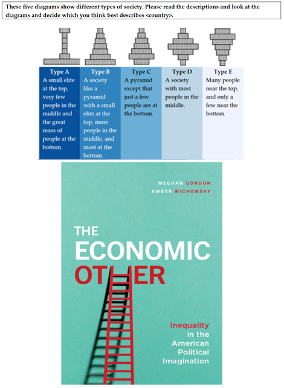
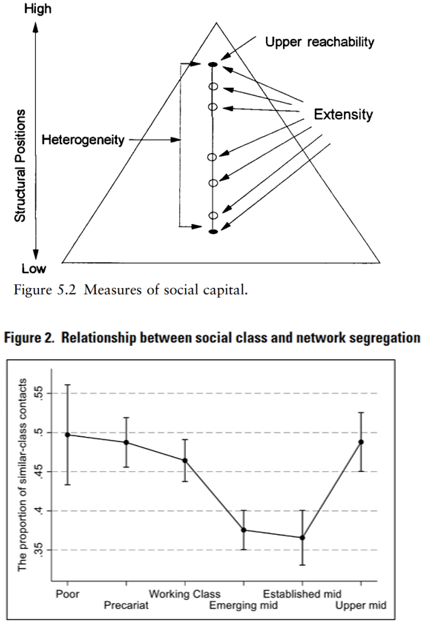
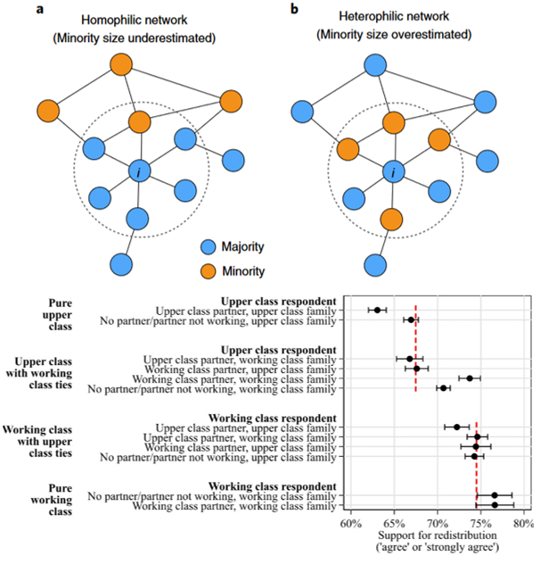
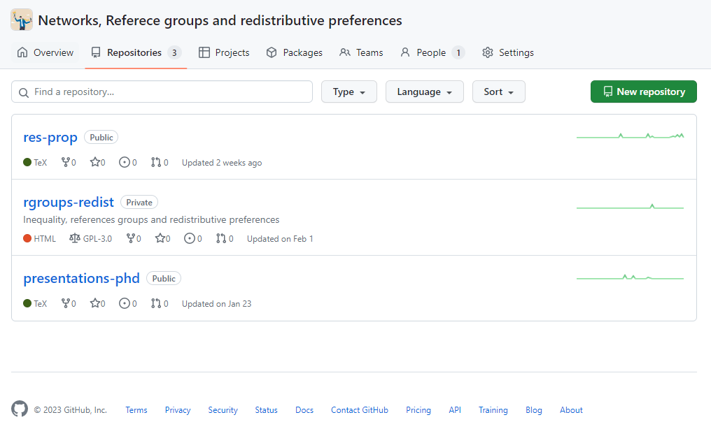

class: middle hide-logo title
```{r xaringanExtra, echo = FALSE}
  xaringanExtra::use_progress_bar(color = "red", location = c("top"))
```

```{r setup, include=FALSE, cache=TRUE}
options(htmltools.dir.version = FALSE)
#install.packages("RefManageR")
library(RefManageR)
BibOptions(check.entries = FALSE, bib.style = "authoryear", style = "html",
           dashed = TRUE,max.names = 2)

bib <- ReadBib("P:/library-full.bib" )
```

.pull-left-narrow[
.espaciosimple[
.tiny[]
]


<br><br><br><br><br><br><br><br>
]

.pull-right-wide[
.right[

.content-box-gray[
# 
## Network segregation, reference groups and preferences for redistribution
]

----
.espaciosimplelineas[
.medium[
Julio Iturra Sanhueza
] 
]

.small[
May 23, Bremen.


  ]

]
]
---
## Introduction 

.pull-left[
 

.small[
-  Economic **inequality** in rise + sanitary **crisis** $\rightarrow$ greater burden on the welfare system]

]

  .pull-right[

.small[
-  Unequally distributed consequences:
      -  **accumulation** of resources $\rightarrow$ resilience capacity 
   
      -  decline in material conditions  of the working class
      -  **subjective corollary** $\rightarrow$ strengthen subjective economic deprivation and undermine perceived social status

- Increase in public concerns and demands for **welfare provision**  

  ]

]

---
## Introduction (...)

.medium[- Redistributive preferences: 
> "as the views about what should be the government's role in taking redistributive measures for providing welfare to their citizens"

- *Previously*: Economic .bold[self-interest] and .bold[value-driven] motivations as an explanatory mechanism for preference formation.

- *Recently*: attention to **psychosocial** processes involved in **perceptions** of economic inequality:
  - .bold[(i) structural positions] and;
  - .bold[(ii) the role of reference groups in social networks.]
]
---
## State of the field
<br><br>

(I) Reference groups, personal networks, and perceived inequality

(II) Structure of association and social networks

(III) Social networks, perceived and preferred inequality
---
### (I) Reference groups, personal networks, and perceived inequality

.pull-left-wide[
.small[

- *Images about inequality:* Reference groups and Reality blend (R&R) approach .small[`r Citep(bib, c("Evans1992","KelleyEvans1995"))`]
  - structural position + social environment
   
- Reference groups and comparison processes  .small[`r Citep(bib, c("Condon2020","clark_who_2010"))`]
  -  direction, target, and evaluations
  
- Perceived economic inequality and demand for redistribution .small[`r Citep(bib, c("trump_income_2023"))`]

  - .bold[relevance] of reference groups and their .bold[attributes]
  - different empirical strategies 
]

]
.pull-right-narrow[ 

]

---
### (II) Structure of association and networks
  
.pull-right-wide[.medium[
- Positions, association, and tie formation: 
  - Homophily in social networks .small[`r Citep(bib, c("mcpherson_birds_2001"))`]
  - Focused organisations of social ties .small[`r Citep(bib, ("feld_focused_1981"))`]

- Social networks and resources:
  -  Personal and .bold[social resources] .small[`r Citep(bib, c("lin_access_1986"))`] 
   -  .bold[Access] $\rightarrow $structural positions: information/support .small[`r Citep(bib, c("lin_building_2001"))`] 
  
- Class inequality in social networks:  
  - social closure, interests, and distinctive practices  .small[`r Citep(bib, c("wright_relative_1992a","otero_open_2021"))`]
  ]
]

.center[
  .pull-left-narrow[ 
  ]
]
???

---
### (III) Social networks, perceived and preferred inequality

.pull-left[
.small[

- Social Segregation and inequality perceptions: 

  - isolated environments $\rightarrow$ social distance .small[`r Citep(bib, c("otero_lives_2022","sachweh_moral_2012"))`] 
  - information $\rightarrow$ inferring inequality .small[`r Citep(bib, c("mijs_inequality_2018","lee_homophily_2019","kim_social_2021"))`] 
      - individual (egocentric) $\rightarrow$  "how is my situation?" 
      - structural (sociotropic) $\rightarrow$  "how is society?'"

- Social ties and the demand for redistribution and welfare
  - social influence (closure) .small[`r Citep(bib, c("lindh_missing_2021"))`] 
  - socialisation (family+friends)  .small[`r Citep(bib, c("lee_consider_2023"))`] 
  ]
]

.pull-right[ ]

---
## Overview

* .bold[role of reference groups:] comparison processes affect perceptions of economic inequality and social status.

* .bold[social structure and network:] structural processes that shape sociability, friendship, and kinship networks.  Observing inequality and heterogeneity of resources in social networks.

* .bold[influence of social environments]: socialization and social influence processes, emphasizing how perceptions and attitudes change according to the network composition.

---
class: middle

.center[
.large[*What is the role of social networks on the preferences for economic redistribution?*
]
]

---
background-image: url("images/model.PNG")
background-size: contain

---
background-image: url("images/papers123.PNG")
background-size: contain
---
background-image: url("images/workingplan.PNG")
background-size: contain
## Working plan:

---
## Open, transparent & reproducible  

* Github repository : https://github.com/orgs/phd-bigsss/repositories
* Open Science Framework: https://osf.io/v9rk7/ 

.center[]

---
class: center, middle

#Thank you 

---
.pull-left-narrow[
.espaciosimple[
.tiny[]
]


<br><br><br><br><br><br><br><br>
]

.pull-right-wide[
.right[

.content-box-gray[
# 
## Network segregation, reference groups and preferences for redistribution
]

----
.espaciosimplelineas[
.medium[
Julio Iturra Sanhueza
] 
]

.small[
May 23, Bremen.


  ]

]
]

