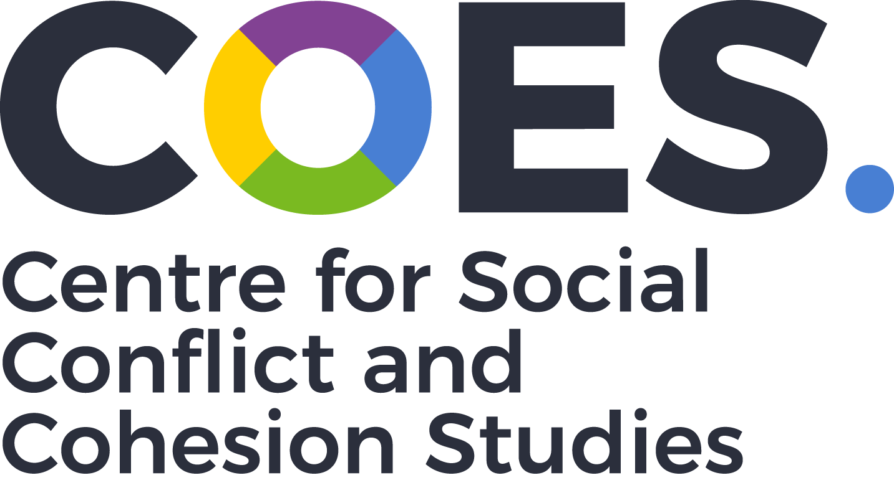
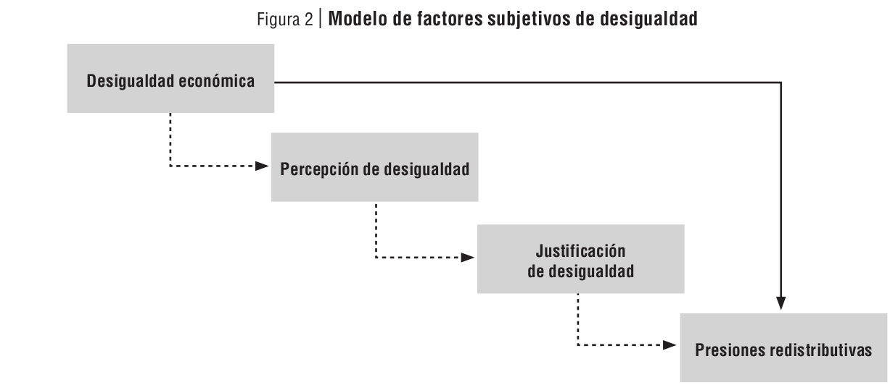
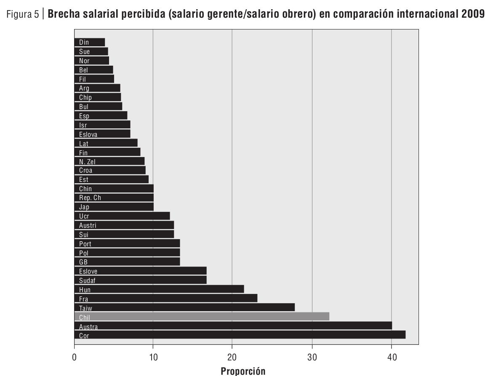
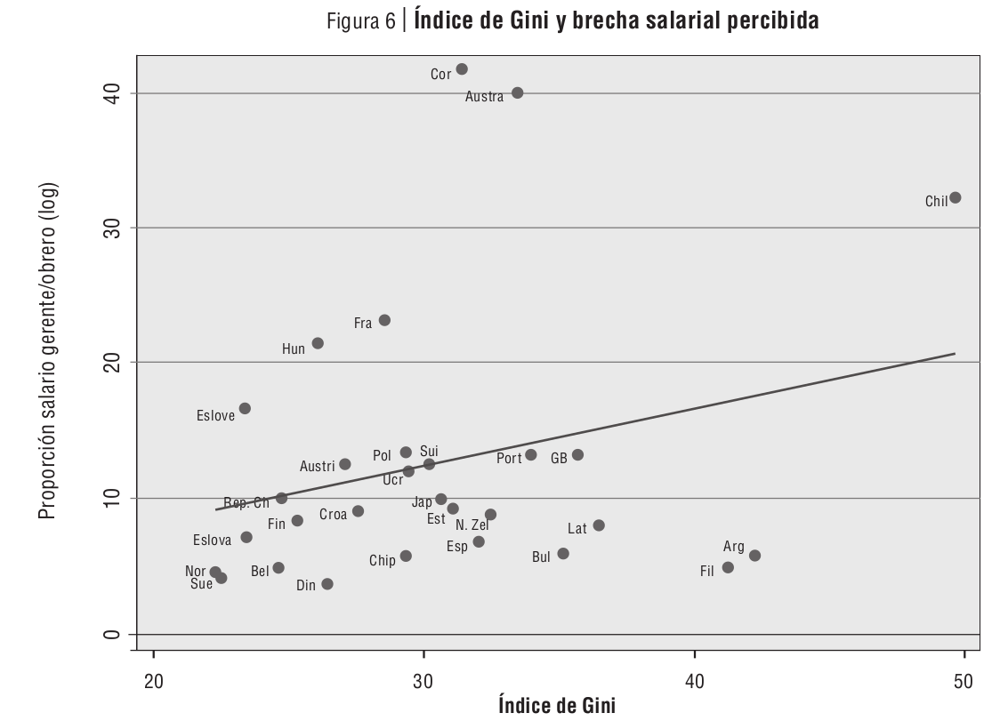
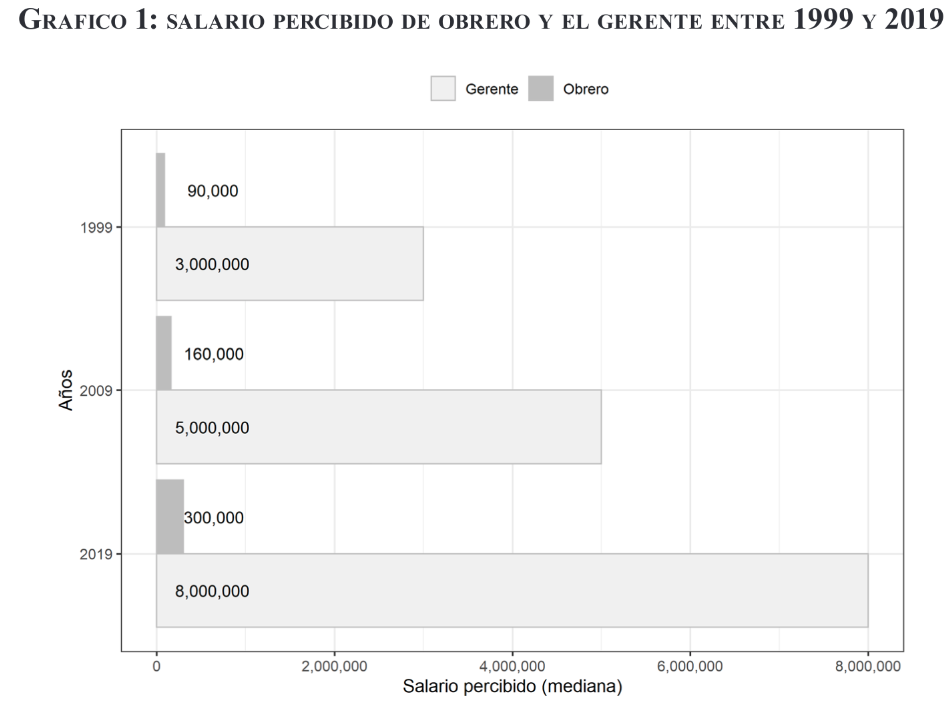
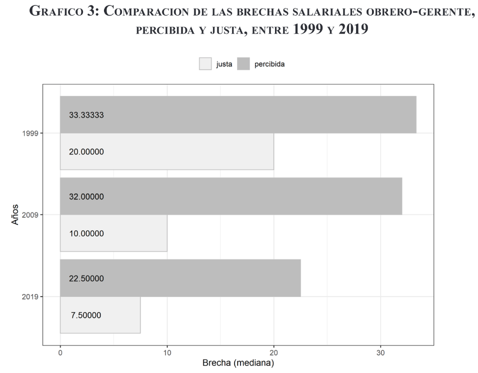
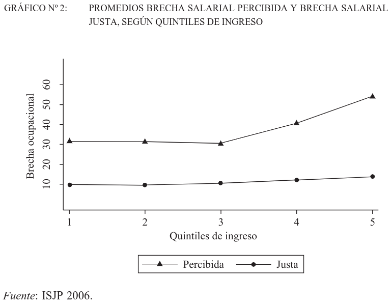
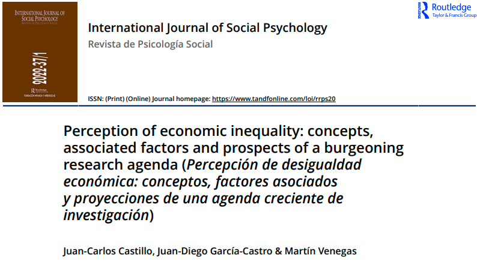

class: middle hide-logo title

```{r xaringanExtra, echo = FALSE}
  xaringanExtra::use_progress_bar(color = "red", location = c("top"))
```

.pull-left-narrow[
.espaciosimple[
.tiny[]
]
<br>
<br>
<br>
<br>
<br>
<br>


<br>


]


.pull-right-wide[
.right[

.content-box-gray[
### Seminario: 
##¿Cuánto cambiaron las percepciones de desigualdad tras el estallido social?
]

----
.espaciosimplelineas[
.medium[
Juan C. Castillo - Universidad de Chile 

[jc-castillo.com](https://jc-castillo.com/)

] 
]


.small[Septiembre 22, 2022 - Santiago, Centro de Estudios Públicos]

]
]

---
class: middle center
<br>

.left[.tiny[Castillo, 2012]]
---
class: middle center


.left[.tiny[Castillo, 2012]]

---
class: middle center

.left[.tiny[Castillo, 2012]]


---
class: middle center

.left[.tiny[Castillo, Meneses, Iturra & Maldonado (2019)]]


---
class: middle center 

.left[.tiny[Castillo, Meneses, Iturra & Maldonado 2019]]


---
class: middle center

## Código & datos análisis 1999-2019:

# [https://github.com/justicia-distributiva/chile-ISSP-gaps-1999-2019](https://github.com/justicia-distributiva/chile-ISSP-gaps-1999-2019)


---
class: middle center
<br>

.left[.tiny[Castillo, 2009]]


---
class: inverse

## .red[Ideas finales]

- relevancia de percepción de desigualdad en relación a justificación y preferencias redistributivas

- otras medidas de percepción de desigualdad (ej, vida cotidiana García-Castro, 2020, 2021)

- corrección de sesgos vía presentación de información objetiva (Iturra et al, 2022)

- desigualdad vs concentración de ingresos

---
class: center middle
## Más información

.center[

]

[doi.org/10.1080/02134748.2021.2009275](https://doi.org/10.1080/02134748.2021.2009275
)

---
class: middle hide-logo title

.pull-left-narrow[
.espaciosimple[
.tiny[]
]
<br>
<br>
<br>
<br>
<br>
<br>


<br>


]


.pull-right-wide[
.right[

.content-box-gray[
### Seminario: 
##¿Cuánto cambiaron las percepciones de desigualdad tras el estallido social?
]

----
.espaciosimplelineas[
.medium[
Juan C. Castillo - Universidad de Chile 

[jc-castillo.com](https://jc-castillo.com/)

] 
]


.small[Septiembre 22, 2022 - Santiago, Centro de Estudios Públicos]

]
]
