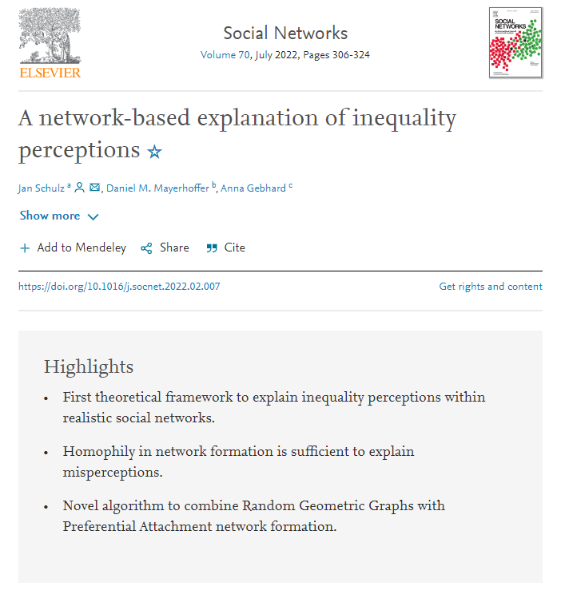

class: middle hide-logo title

```{r xaringanExtra, echo = FALSE}
  xaringanExtra::use_progress_bar(color = "red", location = c("top"))
```

.pull-left-narrow[
.espaciosimple[
.tiny[]
]


<br><br><br><br><br><br><br><br>
]

.pull-right-wide[
.right[

.content-box-gray[
# 
## Social comparison, subjective social status and preferences for redistribution
]

----
.espaciosimplelineas[
.medium[
Julio Iturra - BIGSSS
] 
]

.small[
November 2, Bremen.

[github.com/phd-bigsss](https://github.com/phd-bigsss)
  ]

]
]
---
# Research question

<br>
<br>
.center[
.large[*What is the role of social comparison and subjective social status on redistributive preferences formation?*
]
]
---
# Preferences formation

### Janmaat (2013): 

  - **Perception** $\rightarrow$ .bold[descriptive] (_how is_)
  - **Beliefs**, $\rightarrow$ .bold[normative] (_should be_). 
  - preference as the function of both. 
  - assumes preferences to be more static (than dynamic) 

---
# Preferences formation

### Druckman & Lupia (2000): 

  - evaluation of an external object and it's attributes to be .bold[ranked].
  - preferences as the function of .bold[_beliefs_]. 
  - assume preferences to be dynamic (beliefs = information + perception)


---

# Balance (until now)

- Janmaat's approach:
  - .bold[pros]: distinguish descriptive vs normative. 
  - .bold[cons]: not too clear about what a preference is. Focus on normative dimension.
 
   
- Druckman & Lupia approach: 
  - .bold[pros]: clear definition and model about _what is_ a preference.
  - .bold[cons]: norms (or ideology) does not play any role. Focus on information and cognitive dimension.
  
---

class: middle center
background-image: url("images/lit-rev.PNG")
background-size: contain


---
# Social comparison and subjective status

* How do individuals .bold[perceive] themselves in the social hierarchy?

* .bold[Social comparison] (Festinger, 1954) and .bold[reference groups] (Merton, 1968) 

* _avaliability heuristic_ mechanism: a "social closure" generated by .bold[homophily] and .bold[homogeneity] of reference groups led to biased estimations (Evans, 2004)

---
class: middle center
background-image: url("images/papers.PNG")
background-size: contain

???

The one on the left is a book by Condon and Wichowsky in which they discuss the role of cross-class comparison. 

But, they use low and high **income** as synonyms of class 

- they don't focus on other status aspects as education or occupation. 

---
class: middle center
background-image: url("images/model.PNG") 
background-size: contain

???

This is the theoretical model of Condon and Wichowsky. I am using this model as a base for inspiration.

The book is focused on the US. So, I think that it would be necessary to go further and test it on different societal contexts (with the available sources or primary data).

---
.pull-left[



]


.pull-right[

## Close reference groups

**key topics**:

* SES composition of reference groups 

* the micro-foundation of status perception

* is this social comparison? 
]


---
# Ideas

Theory-related: 

- role of spatial segregation: _worth it?_ (at least for the 1st)

- .bold[social networks] is a field by itself... (maybe for the 2nd)

Not .bold[_so_] theory-related:

- social comparison: direct (ISSP 2019) or indirect (ISSP 99-19) 
- subjective social status (ISSP 92-19) 🔍

---
.pull-left-narrow[
.espaciosimple[
.tiny[]
]
<br><br><br><br><br><br><br><br>


<!--  -->
<!-- <br> -->

]

.pull-right-wide[
.right[

.content-box-gray[
# 
## Social comparison, subjective social status and preferences for redistribution
]

----

.espaciosimplelineas[
.medium[
Julio Iturra - BIGSSS
] 
]

.small[
November 2, Bremen.

[github.com/phd-bigsss](https://github.com/phd-bigsss)
  
  ]

]
]

